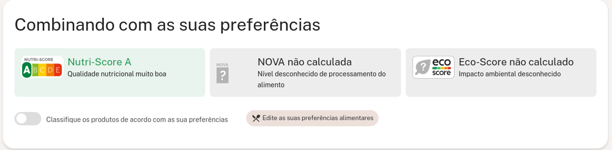

# Teste Estagio Devnology
[Sobre o projeto:](https://hiroyamaguch.notion.site/Vaga-para-Estagi-rio-ec8745c6bd8a414ea8534036b58cfbd8)

# Vaga para Estagiário

Estamos empolgados em apresentar a você nosso desafio técnico para a vaga de estagiário em desenvolvimento na Devnology. Este desafio tem como objetivo avaliar suas habilidades básicas em web scraping, uma atividade fundamental para nós.

### Desafio

Seu objetivo é desenvolver um pequeno script que possa ser executado diretamente no console do navegador para extrair informações do site https://br.openfoodfacts.org/.

### Requisitos

- Acesse a página de um alimento no site https://br.openfoodfacts.org/.
- Desenvolva um script que extraia as informações relevantes do alimento.
- Utilize **`console.log`** para exibir um objeto com essas informações.

### **Informações para Inclusão no Objeto**

A estrutura e informações a serem incluidas no objeto ficam a sua escolha, queremos que tenha liberdade para decidir o que é melhor para o seu script! Mas caso fique em dúvida do que incluir, aqui estão três informações presentes na página que consideramos interessantes:

- **Nutri-Score:** Uma classificação nutricional útil para orientar escolhas alimentares, variando de A (melhor) a E (pior), considerando vários fatores nutricionais.
- **NOVA:** Classificação dos alimentos com base no nível de processamento industrial, de 1 (não processados ou minimamente processados) a 4 (ultraprocessados).
- **Eco-Score:** Indicação do impacto ambiental do produto, levando em conta fatores como emissões de carbono, uso de água e desmatamento.

### Critérios de Avaliação

- Habilidade em acessar e inspecionar elementos em uma página web.
- Conhecimento básico em JavaScript para escrever o script.
- Capacidade de extrair informações específicas da página.
- Clareza e organização do código desenvolvido.
- Tratamento para quando uma das informações não está disponível.

## O que nós gostamos

- Boa organização e estruturação do código.

### Entrega

- Ao finalizar a prova, basta enviar o link do repositório para o e-mail [pedro.antonio@in8.com.br](mailto:pedro.antonio@in8.com.br?subject=resolucao_dev_junior)  com o assunto "Resolução Teste Estagiário".

### Observações

- Você pode escolher qualquer alimento disponível no site para realizar o scraping.
- Não há restrições quanto à tecnologia ou bibliotecas utilizadas, desde que o script possa ser executado diretamente no console do navegador.
- O objetivo principal é extrair informações básicas do alimento, como nome, marca, ingredientes, etc;

### Recursos Úteis

- [Documentação do querySelector](https://developer.mozilla.org/pt-BR/docs/Web/API/Document/querySelector)
- [Introdução à seletores CSS](https://developer.mozilla.org/pt-BR/docs/Learn/CSS/Building_blocks/Selectors)
- [Introdução à seleção de elementos html](https://www.youtube.com/watch?v=VxH9bGV4NBI)

<aside>
🔥 Estamos ansiosos para ver sua solução! Se tiver alguma dúvida, não hesite em entrar em contato conosco. Boa sorte!

</aside>

<aside>
💡 O prazo para entrega do projeto é até o dia 01/03/2024

</aside>
